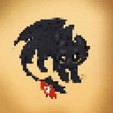

  

# Hi, I'm Rudra 👋

Computer Science student and passionate about Machine Learning, Data Science, LLMs, Generative AI, backend development in Python and Java, and building AI-powered web apps.

## Currently Learning

- Machine Learning
- Prompt Engineering
- Multi-Agent Workflows
- LLMs (from Andrej Karpathy)
- RAG Pipelines

## Connect With Me

- GitHub: https://github.com/Rudra-pointer
- Gmail: rudranarayanadhal75@gmail.com
